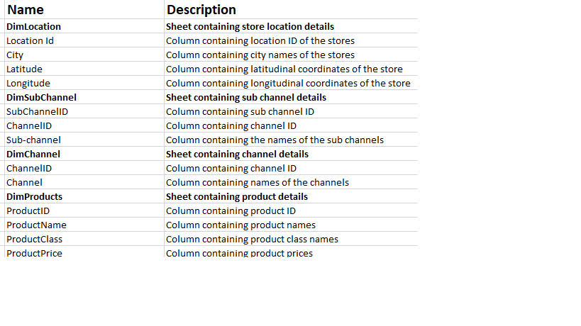

# Forggith-Data-Analysis

## Introduction
**Forggith Pharmaceuticals (Forggith)** is a Pharmaceutical Manufacturing company based in Germany. As a Manufacturing company, they produce medical drugs which get to the consumers through their Distributors.
Forggith provided a template for their distributors to capture records of their sales which are then sent to Forggith on a monthly basis. This data is then used for reporting and analysis by Forggith to achieve their goals Sales and Marketing objectives through tracking and monitoring of KPIs.

**_Disclaimer_**: _All datasets and report do not represent any company or organisation but just a dummy dataset to demonstrate capability of Power BI_

## Power BI Reporting Requirement
Forggith is looking to create some Power BI Reports to assist in guiding their strategies, tactics and operations as a company. For a start, they have identified a couple of numbers they will like to report from their data as reports:
#### Sales Performance
1.	Total  Revenue
2.	Total Revenue Year To Date (YTD)
3.	Total Revenue Previous Year YTD
4.	Total Revenue Same Period Last Year(SPLY)
5.	Total Target
6.	Total TargetYTD
7.	Actual Revenue Performance Previous Year YTD vs Target Previous Year YTD
8.	Actual Revenue Performance YTD vs Target YTD
9.	Revenue Month on Month Percentage Change
10.	Revenue Distribution by Location
11.	Revenue by Channel
12.	Revenue by Product Class
#### Marketing Performance
1.	Revenue Achieved vs Revenue Target
2.	Volume Achieved vs Volume Target
3.	Actual Revenue by Sales Representative
4.	Target Revenue Achievement% by Sales Representative
5.	Actual Volume by Sales Representative
6.	Target Volume Achievement by Sales Representative
7.	Actual Revenue Achievement by Sales Team
8.	Revenue and Volume Achievement by Product
   
## Skills Demonstrated
- Problem understanding 
- Problem solving 
- Critical thinking
- Data cleaning
- Data manipulation
- Model creation
- Calendar table creation
- DAX measures
- Template design
- Data analysis
- Visualisation
- DAX studio
- Written communication
- Power BI

## Data Sourcing
The dataset was provided in an excel format containing two sheets. One sheet contains sales details and the other contains target details

## Data Description
To show an understanding of the dataset, the data description is shown below:

## Mockup draft
Based on the report requirements, a draft of the report was thoughtful created (_shown below_) as a guide in the course of building the report.

## ETL
Power BI desktop was launched and connected to Excel workshop as that is the format of the dataset. Lots of transformation process was carried out such:
- Checked all the tables, rows and columns to ensure consistent formatting, no missing values and duplicate values. 
- Used first row as header on DimLocations table
- Merged querries (DimChannel and DimSubChannel)
- Appended querries (Sales2022 and Sales2023-2025)
- Unpivoted the year columns in Taget table 
- Unabled data load of Sales2022 table and DimChannels
  
After these, I closed and applied settings to start analysis

## Modelling
Power BI automatically creates relationships between the tables. However, I looked through it and made a few adjustments to make it a STAR schema (_shown below_) with 5 dimension tables and 2 fact tables. I also created a calendar table using DAX measures which I linked to the model as well.

Below shows the specific column column the tables are connected to (Relationship)

## DAX measures calculations
The following measures were calculated to aid my analysis.

## Dashboard Design
The company's logo and colour pallet was provided which I used in designing the sales and marketing performance backgrounds on powerpoint(_shown below_), saved as PNG and used as background image on Power BI

## Analysis and Visualization
Using the mockup draft and following the report requirements, two page dashboard was built with few modifications from the mockup draft 😉. The pages show sales and marketing performance overviews as required.

The inteeractive dashboard can be accessed [here](https://app.powerbi.com/view?r=eyJrIjoiMmJkMWNiNWEtODU5Ni00NzgwLWFiYzktYzA4MjdkMGU3ZTYxIiwidCI6ImFmMWJhNzExLTA2MmMtNGYzZS04YmNjLWQyY2U4N2RjNGQwYSJ9)

## Conclusion
The goal of this report is to have a dashboard to that will guide strategies, tactics and operations as acompany.
- The Sales Representative can track their performances through-out the periods to plan their marketing activities.
- The Team Managers can track their teams' performances through-out the periods to plan their teams' activities.
- Executive team can track Revenue numbers to monitor alignment with the set targets to influence medium to long term strategies.

